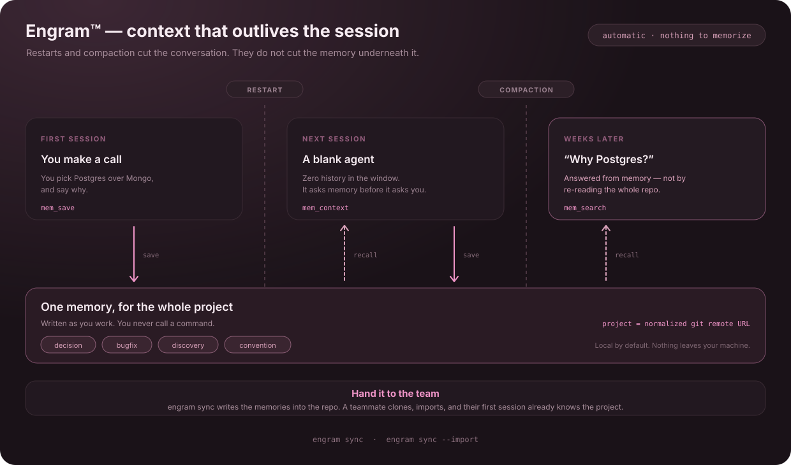
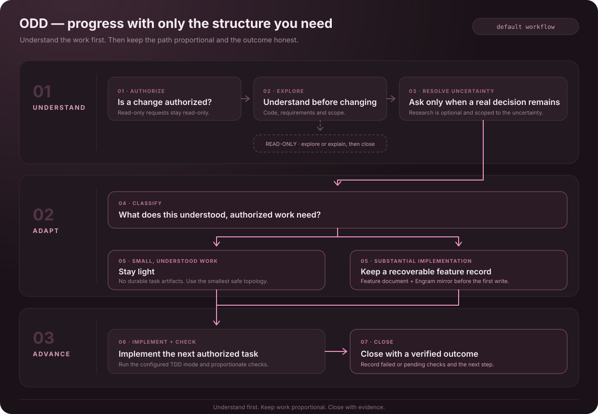
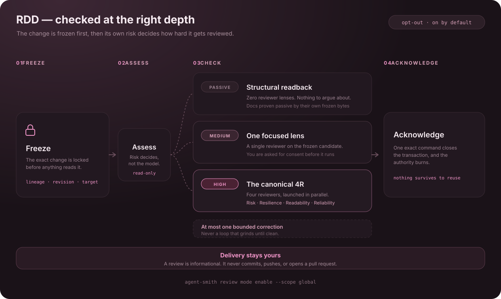
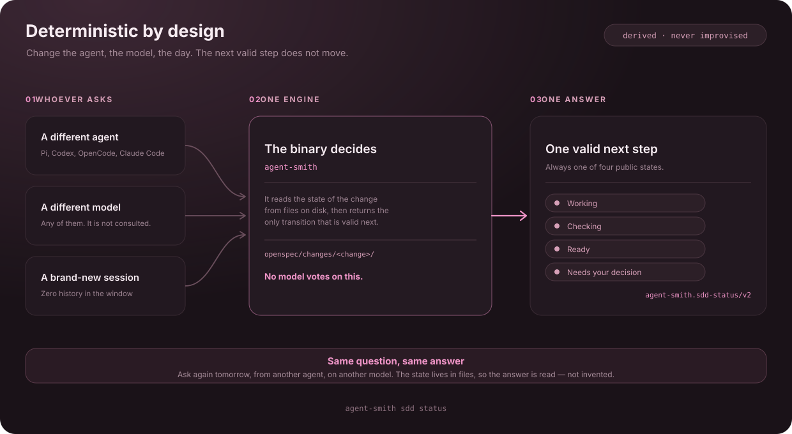
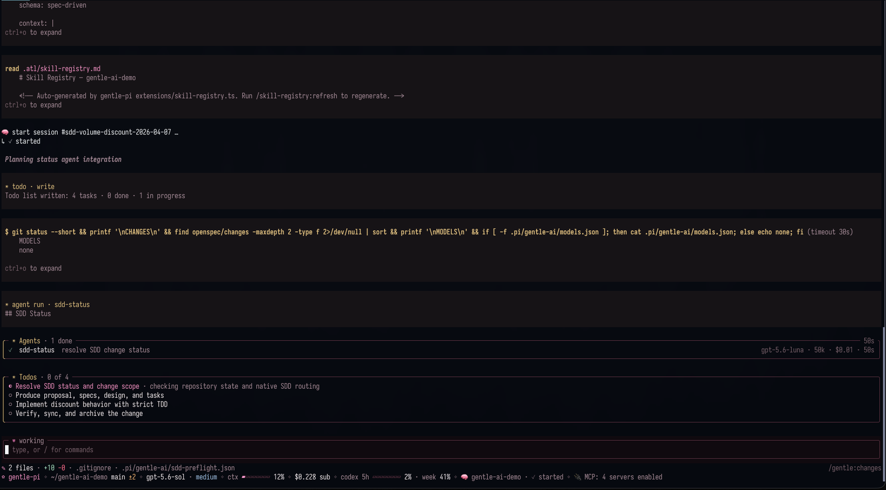
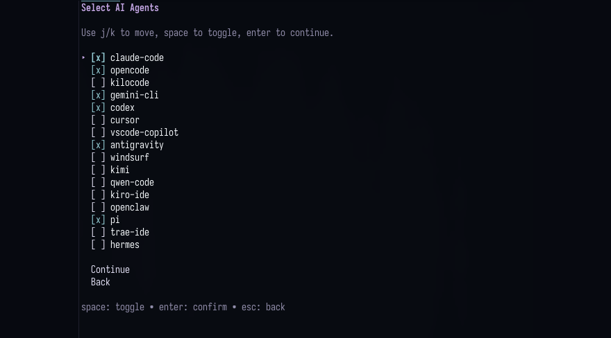

<!-- markdownlint-disable-next-line MD041 -->
<a id="top"></a>

<div align="center">


<h1>agent-smithâ„¢</h1>

<p><strong>The deterministic engineering environment for the AI agent you already use.</strong></p>

<p>
<a href="https://github.com/jonsanchezr/agent-smith/releases"></a>
<a href="https://github.com/jonsanchezr/agent-smith/stargazers"></a>


<a href="LICENSE"></a>
</p>

<p>
<a href="https://gentlemanprogramming.com/"><strong>Website</strong></a> &bull;
<a href="docs/quickstart.md"><strong>Quickstart</strong></a> &bull;
<a href="docs/intended-usage.md"><strong>Docs</strong></a> &bull;
<a href="https://agent-smith-wiki.gentlemanprogramming.com/"><strong>Wiki</strong></a>
</p>

<br/>

<p>
Your agent writes code, then forgets everything. It has no opinion about your project,
and no way to prove what it did beyond asking you to read every line.
<strong>agent-smith gives it memory, a workflow, and evidence.</strong>
</p>

<p>
 <h3>See it in action</h3>

   <p>
   One prompt, from idea to reviewed commit: memory, workflow, and evidence in a real session.
   </p>

https://github.com/user-attachments/assets/fa5c0cfe-06e7-4c0d-bd6e-8ac7cb934339


   <p>Prefer Spanish subtitles?</p>
   

https://github.com/user-attachments/assets/6d2bc422-a4dd-4ecf-a04b-fcd3bea7fea9


</p>

<br/>

<!--
  HERO SLOT — the only animation on this page. Features is all still: four
  diagrams for the concepts, two captures as proof the thing runs. Motion is
  spent once, here, right after the pitch lands.

  Uncomment when docs/assets/features/hero-pi.gif exists. It is a real-time capture
  of the complete Pi startup: banner, extensions, skills and startup output, never
  trimmed. A stripped startup does not look like the real thing.


<br/>
-->

<sub><strong>If agent-smith made your agent worth trusting, a star helps other people find it.</strong></sub>

<!--
  sealed_token is a GitHub fine-grained token encrypted against Star History's
  public key, so only the encrypted value is published here. It is required
  because GitHub restricted the stargazers API to a repository's admins and
  collaborators on 2026-06-30; without it the chart renders an error placeholder.
  Regenerate it at https://www.star-history.com/?repos=jonsanchezr%2Fagent-smith&type=date&legend=top-left
-->

<a href="https://www.star-history.com/?repos=jonsanchezr%2Fagent-smith&type=date&legend=top-left">
  <picture>
    <source media="(prefers-color-scheme: dark)" srcset="https://api.star-history.com/chart?repos=jonsanchezr%2Fagent-smith&type=date&theme=dark&legend=top-left&sealed_token=zwrd_DfwYZeJU7nhGYNtREEheKWYEslW_uzrqORlZ36v-JSMepdqGLkKExp1M-xbNq6t-ebVS5iM3WoPDO26tXbSGkjXC2Jo3kHQ3uNzlRkCrWoqRHkPVQXvosKciY109ObiwGV1z8aajyedcloppmekCGrvVKJb6KWxGLXW_mHcRAVIBZUOa4SzW75D" />
    <source media="(prefers-color-scheme: light)" srcset="https://api.star-history.com/chart?repos=jonsanchezr%2Fagent-smith&type=date&legend=top-left&sealed_token=zwrd_DfwYZeJU7nhGYNtREEheKWYEslW_uzrqORlZ36v-JSMepdqGLkKExp1M-xbNq6t-ebVS5iM3WoPDO26tXbSGkjXC2Jo3kHQ3uNzlRkCrWoqRHkPVQXvosKciY109ObiwGV1z8aajyedcloppmekCGrvVKJb6KWxGLXW_mHcRAVIBZUOa4SzW75D" />
    
  </picture>
</a>

<br/>

<sub><strong>WORKS WITH THE AGENT YOU ALREADY HAVE</strong></sub>

<strong><a href="docs/agents.md#pi">Pi</a></strong> ·
<strong><a href="docs/agents.md#opencode">OpenCode</a></strong> ·
<strong><a href="docs/agents.md#claude-code">Claude Code</a></strong> ·
<strong><a href="docs/agents.md#codex">Codex</a></strong> ·
<strong><a href="docs/agents.md#cursor">Cursor</a></strong> ·
<strong><a href="docs/agents.md#vs-code-copilot">VS Code Copilot</a></strong> ·
<strong><a href="docs/agents.md#gemini-cli">Gemini CLI</a></strong> ·
<strong><a href="docs/agents.md#kilo-code">Kilo Code</a></strong><br/>
<strong><a href="docs/agents.md#kimi-code">Kimi Code</a></strong> ·
<strong><a href="docs/agents.md#kiro-ide">Kiro IDE</a></strong> ·
<strong><a href="docs/agents.md#qwen-code">Qwen Code</a></strong> ·
<strong><a href="docs/agents.md#hermes">Hermes</a></strong> ·
<strong><a href="docs/agents.md#antigravity">Antigravity</a></strong> ·
<strong><a href="docs/agents.md#windsurf">Windsurf</a></strong> ·
<strong><a href="docs/agents.md#openclaw">OpenClaw</a></strong> ·
<strong><a href="docs/agents.md#trae">Trae</a></strong> ·
<strong><a href="docs/agents.md#conductor">Conductor</a></strong>

<sub>17 integrations · native configuration · <a href="docs/agents.md">compare capabilities →</a></sub>

</div>

<div align="center"></div>

## Features

---

### Engram™ — Keep your project context



The cost of a fresh session is not the tokens — it is you, re-explaining the same decisions every morning. Engram removes that: your agent writes down what it learns as it goes and reaches for it before it reaches for you, so context accumulates instead of resetting.

**[Docs →](docs/engram.md)**

---

### ODD — Keep small work small



Small changes should not need a planning pipeline, and larger work should not lose its context between sessions. **Organic Driven Development (ODD)** keeps understood changes lightweight and gives substantial, authorized work one recoverable feature document. The agent explores before changing code, checks the results, and keeps progress current so work can resume without rebuilding the plan.

**[Docs →](docs/usage.md#organic-driven-development-odd)**

---

### Strict TDD — Prove behavior when enabled

ODD uses the configured TDD mode and exact test runner. When Strict TDD is enabled, capture a failing behavior test before implementation, make it pass, then refactor while tests stay green. When disabled, run applicable functional checks anyway. The presence of tests alone does not enable Strict TDD.

**[Docs →](docs/usage.md#organic-driven-development-odd)**

---

### RDD — Check finished work at the right depth



Receipt-Driven Development (RDD) is on by default and opt-out: run `agent-smith review mode disable` to turn it off. Explicit global or clone-local OFF choices remain OFF. Its point is that a review cannot drift: the candidate is frozen before anything reads it, so the evidence belongs to the exact version you are about to rely on — not to whatever the worktree looked like a moment later. The depth comes from that frozen candidate rather than from the model's judgment, and the result is informational. Commit, push and release stay your call.

**[Docs →](docs/review-integration.md)**

---

### Deterministic by design — Know the next valid step



A model that guesses the next step guesses differently tomorrow, and differently again for your teammate. That is the gap between a workflow and a suggestion. The **`agent-smith` binary** owns native RDD review transitions; ODD guidance keeps ordinary work proportional to the request. Review evidence is bound to the candidate rather than a model's recollection.

**[Docs →](docs/trigger-rules.md)**

---

### Gentle Shell — A complete workspace for Pi



Gentle Shell is a separate Pi integration package. Agent Smith configures supported agents; Gentle Shell owns its own Pi runtime, agents, and interface. Installing or updating this binary does not itself establish Pi behavior parity.

**[Docs →](docs/pi.md)**

---

### 17 agents — Keep the agent you already use



agent-smith brings its shared workflow to Pi, OpenCode, Claude Code, Codex, and thirteen more agents. Each integration uses that agent's native capabilities, so available features such as delegation and RDD review can differ.

**[Docs →](docs/agents.md)**

---

### Also in the box

| Component | What it does |
| :--- | :--- |
| **Skills library** | Loaded automatically when the task matches |
| **Context7 MCP** | Optional, selectable live framework and library documentation |
| **CodeGraph** | Read-only symbol graph of your codebase |
| **Security deny-list** | Blocks `~/.ssh`, `.env` and credential files |
| **Config backups** | Snapshotted before every single write |
| **Doctor** | `agent-smith doctor` — read-only health report |
| **Personas** | Optional personas; Gentleman is a caring but rigorous mentor who guides you toward your goal |
| **Themes** | Gentleman and Gentleman-Cute |
| **Model assignment** | Configure supported agent and review-role models where available |

> **Every component, skill and preset: [Full breakdown →](docs/components.md)**

<div align="right"><a href="#top">Back to top</a></div>

<div align="center"></div>

## Get started

```bash
# macOS (Homebrew)
brew install jonsanchezr/tap/agent-smith

# macOS / Linux (curl)
curl -fsSL https://raw.githubusercontent.com/jonsanchezr/agent-smith/main/scripts/install.sh | bash

# Windows (PowerShell) — source install of the latest release, needs Go 1.25.10+
go install github.com/jonsanchezr/agent-smith/v4/cmd/agent-smith@v4.0.0
```

```bash
agent-smith          # pick your agents, components and persona
agent-smith doctor   # verify — read-only, changes nothing
```

Then use your agent normally. Your configs are snapshotted before every write, and **agent-smith never installs an AI agent for you** — it configures what you already have.

> **Beta channel, signature verification and per-distro prerequisites: [Quickstart →](docs/quickstart.md)**

<div align="right"><a href="#top">Back to top</a></div>

<div align="center"></div>

## Documentation

| Where to go | What you'll find |
| :--- | :--- |
| **[Intended Usage](docs/intended-usage.md)** | The mental model. If you read one page, read this one. |
| **[Quickstart](docs/quickstart.md)** · **[Usage](docs/usage.md)** | Install, prerequisites, every CLI command and flag |
| **[Agents](docs/agents.md)** | Feature matrix and per-agent notes for all 17 |
| **[ODD](docs/usage.md#organic-driven-development-odd)** · **[Routing](docs/trigger-rules.md)** | Everyday direct and delegated work |
| **[Review](docs/review-integration.md)** · **[Architecture](docs/architecture/organic-rdd.md)** | The RDD contract, lifecycle and threat model |
| **[Engram](docs/engram.md)** · **[Components](docs/components.md)** | Memory commands, skills, presets and personas |
| **[Contributing](CONTRIBUTING.md)** · **[Codebase Guide](docs/CODEBASE-GUIDE.md)** | Extend or contribute |
| **[Telemetry](docs/telemetry.md)** | What we count, and how to turn it off |

<div align="right"><a href="#top">Back to top</a></div>

<div align="center"></div>

## Community

Everything labelled [`up-for-grabs`](https://github.com/jonsanchezr/agent-smith/issues?q=is%3Aissue+is%3Aopen+label%3Aup-for-grabs) is scoped, approved and unclaimed — pick one and it's yours.

<div align="center">

<a href="docs/community-roadmap.md"></a>
<a href="CONTRIBUTING.md"></a>
<a href="CONTRIBUTORS.md"></a>

<br/><br/>

<a href="CONTRIBUTORS.md">
  
</a>

<p><sub>This project exists because of these people.</sub></p>

</div>

<div align="right"><a href="#top">Back to top</a></div>

<div align="center"></div>

## Built with agent-smith

Shipped something with agent-smith? Wear the rose. Paste this into your README and the badge links back here:

<div align="center">

<a href="https://github.com/jonsanchezr/agent-smith">
  
</a>

</div>

```html
<a href="https://github.com/jonsanchezr/agent-smith">
  
</a>
```

Prefer plain Markdown?

```markdown
[](https://github.com/jonsanchezr/agent-smith)
```

Keep the image URL exactly as shown — it is how I find and feature the projects that carry the badge.

<div align="right"><a href="#top">Back to top</a></div>

<div align="center"></div>

## About the author

Built by [Alan Buscaglia](https://github.com/jonsanchezr) (Gentleman Programming): 15 years of enterprise architecture, a community of thousands of developers testing these tools daily, and one rule for AI-assisted work — **verifying beats generating**.

Teams adopting AI and finding it isn't working — resistance, everyone prompting their own way, no shared quality bar — can reach out about **[engagements built on these same open-source tools →](docs/consulting.md)**.

<div align="center">

<a href="https://gentlemanprogramming.com/"></a>
<a href="https://www.youtube.com/@GentlemanProgramming"></a>
<a href="https://github.com/jonsanchezr"></a>
<a href="mailto:gentleman@ohmybitz.com"></a>

</div>

---

<div align="center">


<br/>

<h3>agent-smith is crafted with agent-smith</h3>

<br/><br/>

<a href="LICENSE"></a>

</div>

> **Trademark notice:** The Agent Smithâ„¢ and Engramâ„¢ names and logos are trademarks of Alan Buscaglia. Both marks are used throughout this document; the symbol appears on the first prominent mention of each, and this notice covers the rest. The MIT License applies to the code; it does not permit implying endorsement or official affiliation. See [TRADEMARKS.md](TRADEMARKS.md).

